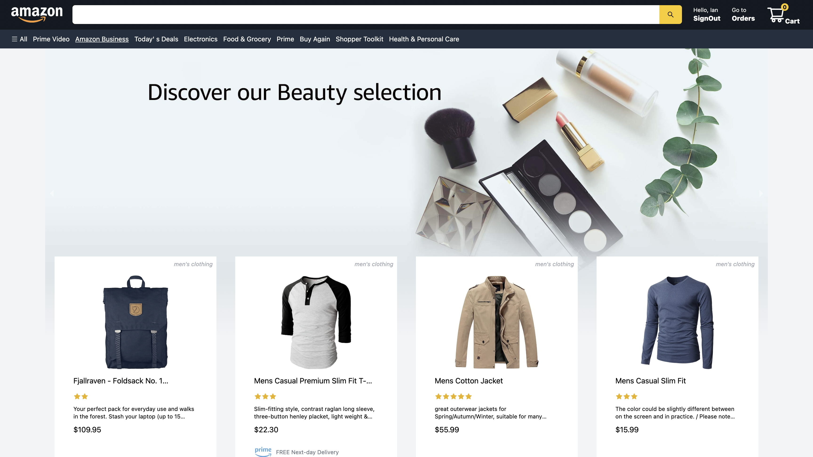

# Amazon Clone

An Amazon-clone project, which is built
by [Next.js](https://nextjs.org/), and bootstrapped with [create-next-app](https://github.com/vercel/next.js/tree/canary/packages/create-next-app).

Products data come from [Fake Store API](https://fakestoreapi.com/)

See [Demo on vercel](https://amazon-clone-enhsu.vercel.app/)

See [Github source code](https://github.com/enhsu/amazon-clone)

## Functional Parts

- SignIn with `Google` or `Github` account with `NextAuth` on top right side
  
  
- SignOut on top right side
  
- Add items to `Cart`
  
- Payment with [Stripe](https://stripe.com/)
  
  
  - See test card [here](https://stripe.com/docs/testing?numbers-or-method-or-token=card-numbers#cards)
- See `Orders` while SignIn
  

## Tec

- [Next](https://nextjs.org/)
- [React](https://reactjs.org/)
- [Redux](https://redux.js.org/)
- [Typescript](https://www.typescriptlang.org/)
- [TailwindCSS](https://tailwindcss.com/)
- [NextAuth](https://next-auth.js.org/)
- [Stripe](https://stripe.com/)
  - [webhooks](https://stripe.com/docs/webhooks)
- [Firebase](https://firebase.google.com/)

## Development Notes

- [The development progress](./NOTES/Progress/README.md)

## Local Getting Started

```bash
$ yarn install
$ yarn dev
# need .env.local file to make it work fine
```

Open [http://localhost:3000](http://localhost:3000) with your browser to see the result.

Variables in .env.local

- `NEXTAUTH_SECRET`, for NextAuth
- `GOOGLE_CLIENT_ID`, for NextAuth GoogleProvider
- `GOOGLE_CLIENT_SECRET`, for NextAuth GoogleProvider
- `GITHUB_ID`, for NextAuth GitHubProvider
- `GITHUB_SECRET`, for NextAuth GitHubProvider
- `STRIPE_PUBLIC_KEY`, for Stripe
- `STRIPE_SECRET_KEY`, for Stripe
- `STRIPE_SIGNING_SECRET`, for Stripe verify the HOST
- `SERVICE_ACCOUNT_KEY`, for Stripe webhook
- `FIREBSE_CONFIG`, for firebase
- `HOST`, host url

## Next steps

- Keep `Cart` data after SignIn
- More `Orders` detail
- Upload product by user
- Authenticated routing
- Unit test
